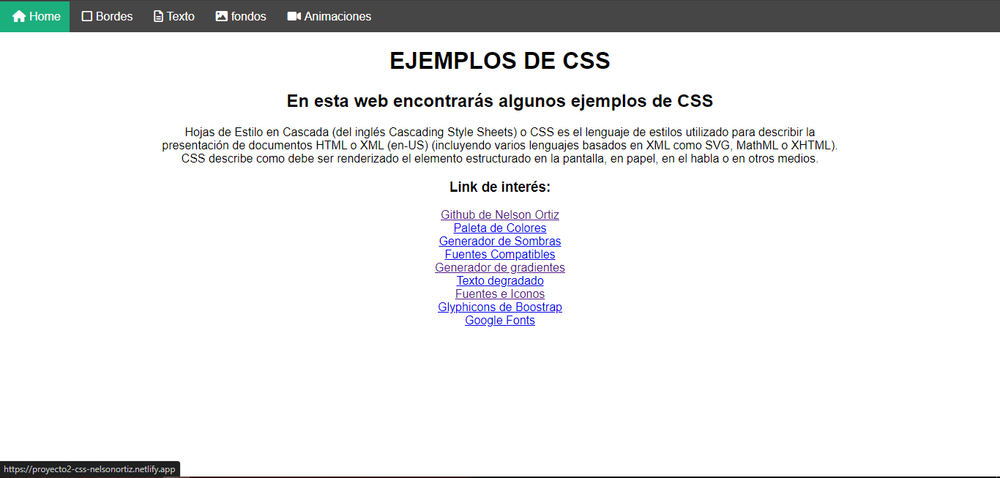

# PROYECTO CSS

[PROPIEDADES CSS](https://proyecto2-css-nelsonortiz.netlify.app/)

En este repositorio se propuso mostrar las diferentes propiedades de CSS.

En esta página podrás encontrar:

-   La definición de CSS
-   Los diferentes bordes y sus estilos
-   Fondos y sus diferentes estilos
-   Animaciones

La página ha sido creada utilizando HTML y CSS. Esta página es una excelente oportunidad para practicar habilidades adquiridas y aprender más sobre HTML y CSS.
